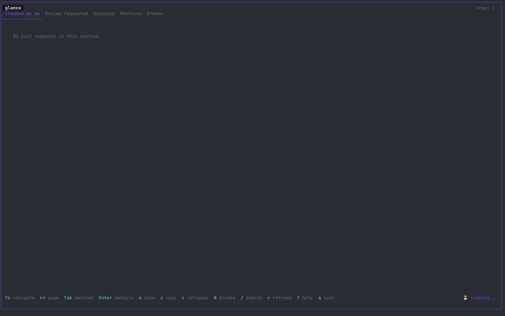

# Glance

Your GitHub pull requests, at a Glance.



**glance** is a terminal dashboard that gives you a unified view of your GitHub pull requests across all your organizations. No more juggling browser tabs — review, comment, approve, and merge without leaving the terminal.

## What it solves

In the agentic era, your terminal is the cockpit. Agents are spinning up branches, opening PRs, and asking for reviews faster than ever — and the last thing you want is to break flow, leave the terminal, and lose yourself in a maze of browser tabs just to keep up.

glance keeps the review loop where the work already lives. If you work across multiple GitHub organizations and repositories, keeping track of PRs is painful. glance puts everything in one place:

- **Created by me** — your open PRs and their CI/review status
- **Review requested** — PRs waiting for your review
- **Assigned** — PRs assigned to you
- **Mentions** — PRs where you're mentioned
- **Browse** — jump into any repo, scan its open PRs, or open a new PR from a local branch

New PRs are highlighted with a red marker so you never miss what just came in. Desktop notifications alert you to new assignments, review requests, and mentions. You can drill into any PR to read diffs, view CI checks, leave comments, approve, request changes, merge, close/reopen, or flip between draft and ready — all from the terminal. Mark repos as favorites to pin them to the top, and use fuzzy branch search to open a new PR without leaving the dashboard.

## Install

### Quick install (macOS / Linux)

```bash
curl -fsSL https://raw.githubusercontent.com/midhun-mohan/glance/main/install.sh | sh
```

### Go install

```bash
go install github.com/midhun-mohan/glance/cmd/glance@latest
```

### Download binary

Grab the latest binary for your platform from [GitHub Releases](https://github.com/midhun-mohan/glance/releases).

### Build from source

```bash
git clone https://github.com/midhun-mohan/glance.git
cd glance
make build
./bin/glance
```

## Prerequisites

glance uses the [GitHub CLI](https://cli.github.com/) for authentication. Install it and log in:

```bash
# Install gh (macOS)
brew install gh

# Install gh (Linux)
# See https://github.com/cli/cli/blob/trunk/docs/install_linux.md

# Authenticate
gh auth login
```

## Usage

```bash
glance
```

### Flags

```
-s, --section string     Start on a section (created|reviews|assigned|mentions)
-o, --org string         Limit to specific org(s), comma-separated
-r, --repo string        Limit to specific repo(s), comma-separated
-f, --filter string      Apply a filter expression on startup
-p, --preset string      Apply a saved filter preset
    --refresh string     Override auto-refresh interval (e.g. "2m", "30s")
    --no-notifications   Disable desktop notifications
    --config             Open config file in $EDITOR
```

### Examples

```bash
# Show only review requests
glance -s reviews

# Limit to specific orgs
glance -o mycompany,opensource-org

# Start with a filter
glance -f "repo:mycompany/api* status:open"

# Faster refresh
glance --refresh 1m
```

## Keybindings

### Main view

| Key | Action |
|-----|--------|
| `↑/k` `↓/j` | Navigate |
| `J` / `Shift+↓` | Jump to next repo group |
| `K` / `Shift+↑` | Jump to previous repo group |
| `gg` / `G` | Jump to top / bottom |
| `Ctrl+d` / `Ctrl+u` | Half-page down / up |
| `←/h` `→/l` | Previous / next page |
| `Tab` / `Shift+Tab` | Next / previous section |
| `1-5` | Jump to section |
| `Enter` | Open PR details |
| `o` | Open PR in browser |
| `y` | Copy PR URL |
| `c` | Collapse/expand repo group |
| `C` | Collapse/expand all groups |
| `f` | Toggle repo favorite (pins repo to top) |
| `F` | Show favorite repos only |
| `B` | Browse a repo (open its PRs or start a new PR) |
| `P` | New PR — pick a branch from the repo under the cursor |
| `M` | Merge PR under cursor (Created section, squash) |
| `/` | Search / filter |
| `Esc` | Clear search / filter |
| `p` | Filter presets |
| `r` | Refresh |
| `?` | Toggle help |
| `q` | Quit |

### Detail view

| Key | Action |
|-----|--------|
| `↑/↓` | Navigate files / scroll diff / navigate checks |
| `Tab` | Switch between file list and diff/info panel |
| `i` | Toggle between Diff and Info tab |
| `w` | Toggle diff line wrap |
| `< / >` (or `, / .`) | Resize split (file list ⇄ diff) |
| `c` | Comment (line comment in diff, general comment elsewhere) |
| `o` | Open PR or CI check in browser |
| `y` | Copy PR URL |
| `A` | Approve PR |
| `X` | Request changes |
| `M` | Merge PR (squash) |
| `E` | Close / reopen PR |
| `D` | Toggle draft ⇄ ready for review |
| `P` | Create PR (from a branch preview) |
| `r` | Refresh |
| `Esc` | Close detail view |

### Filter expressions

```
repo:mycompany/*          # Wildcard repo match
status:open               # PR status
label:urgent              # Label filter
created:<7d               # Created within last 7 days
```

Combine filters with spaces (AND logic): `repo:acme/* status:open label:bug`

## Configuration

Config file location: `~/.config/glance/config.yaml` (or `~/.glance.yaml`)

Open it with `glance --config` or create it manually:

```yaml
orgs:
  auto_detect: true
  include: []       # Limit to these orgs (overrides auto_detect)
  exclude: []       # Exclude these orgs from auto_detect

refresh:
  interval: "5m"

notifications:
  enabled: true
  events:
    new_assignment: true
    review_requested: true
    status_change: true
    mentions: true
    include_team: false   # Set true to also notify for team-based assignments/reviews

# Named filter presets (use with 'p' key or --preset flag)
presets:
  urgent: "label:urgent status:open created:<7d"
  my-team: "repo:mycompany/api* repo:mycompany/web*"

# Repos pinned to the top of each section (toggle with 'f' in the UI)
favorites:
  - mycompany/api
  - mycompany/web
```

## Notifications

glance sends desktop notifications when new PRs appear in your Review Requested, Assigned, or Mentions sections. Works on:

- **macOS** — native notifications via osascript
- **Linux** — via `notify-send` (libnotify)
- **Windows** — PowerShell toast notifications (Windows 10+)

Disable with `--no-notifications` or set `notifications.enabled: false` in config.

## License

MIT
